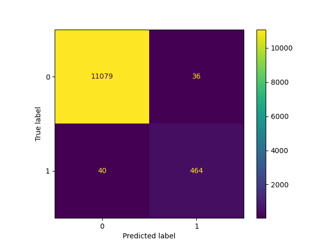

### Bearings Prediction EDA

**Author** : Jaidev Prabhu

#### Executive summary
This project aims to develop a predictive model for the failure of IoT-enabled rotating machinery using machine learning techniques. The model will leverage data from sources like NASA's Prognostics Center of Excellence Data Set Repository. The goal is to enable accurate, real-time failure prediction on edge devices, reducing downtime, optimizing maintenance schedules, and improving cost-effectiveness. 

#### Rationale
**Why should anyone care about this question?**

Predictive maintenance of industrial machinery, especially in remote or harsh environments, is a critical challenge. Unexpected failures lead to costly downtime, production losses, and potential safety hazards. This project addresses this challenge by developing a machine learning model for real-time failure prediction on edge devices. This approach reduces reliance on cloud connectivity, improves data privacy, and enables timely maintenance interventions, resulting in significant cost savings and increased operational efficiency. The focus on IoT-enabled rotating machinery ensures wide applicability across various industries, including manufacturing, energy, and transportation. 

#### Research Question
**What are you trying to answer?**
How can we accurately predict the failure of IoT-enabled rotating machinery, such as HVAC systems, turbines, engines, and motors, to prevent breakdowns and optimize maintenance schedules?

#### Data Sources
**What data will you use to answer you question?** 

The model we develop will leverage data from sources like NASA's Prognostics Center of Excellence Data Set Repository.
The Experiment.md file and the referenced research paper give more details about the data.  

#### Methodology
**What methods are you using to answer the question?**

**Data Preprocessing:** 
- CCleaning the dataset, handling missing values, normalizing or scaling features. The data from the NASA collections archive was downloaded and evaluated. See the EDA analysis document referenced below.

**Feature Engineering:**  
- Creating new features from the existing data that can improve model performance. Since each data point collected consists of ~20,000 values of the accelerometer sensor within a period of 1 second, we will utilize statistical methods such as min, max, std, RMS (since this is a rotating machine), and advanced statistical techniques such as Skew, Surtosis, and Shannon's Entropy - that were mentioned in the research paper to collect machine-specific signatures.

**Model Selection:** 
- Classification models such as Decision Trees, K-nearest neighbors (KNN), and Support Vector Machines (SVM) are used to predict failures. The aim is to develop a generic model applicable to various rotating machinery types.

**Model Evaluation:** Cross-validation and metrics like accuracy, precision, recall, and F1-score will be used to evaluate the performance of the models across different types of machinery. We will display the results using the Confusion Matrix and RoC Curves.

#### Results
**What did your research find?**
We completed one data processing round, and the classification models' results are detailed in the Classification document referenced below.
One example - Model using Support Vector Machine (**SVM**) is shown here:

#### Next steps
**What suggestions do you have for next steps?**
Since we have obtained good accuracy for determining faults, we next look to see how the data can be utilized to detect early warnings. We will look at Time Series forecasting and multinomial classification of the problem classes. Currently, we only have two classes - Negative signifying no-fault and Positive signifying fault detection. We want to add a *pre-fault-detect* class that can enable machinery maintenance to be scheduled to prevent downtimes.

#### Outline of project

[EDA Analysis](./EDA_Analysis.md)

[Classifiers Model Training, Prediction, Scores](./Classification.md)

##### Contact and Further Information
[mailto:jaidev@datasolve.ai](EMail)
